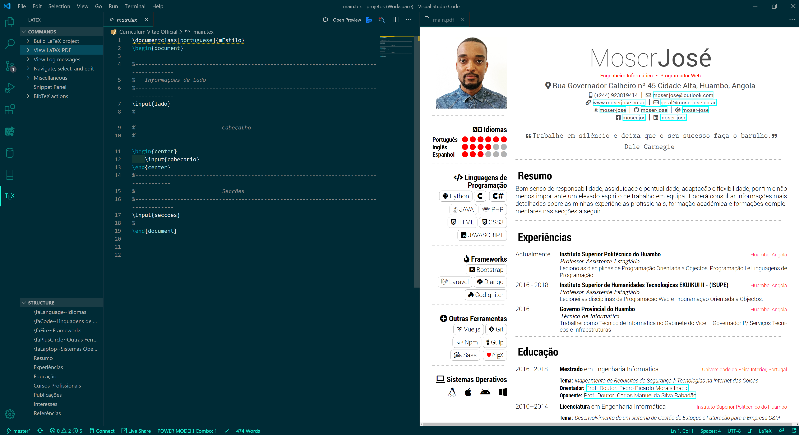
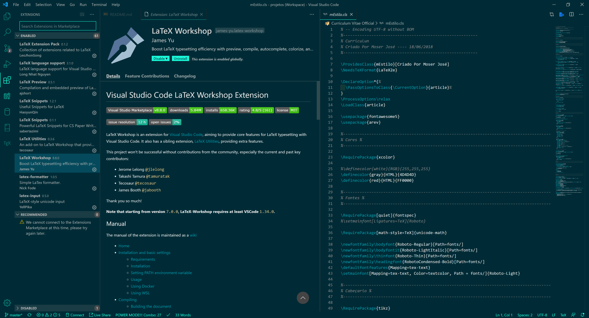

# Curriculum Pessoal

========


Este é o meu curriculum, criado em latex com a inclusão de vários ``Packages``. Pode ser usado como tamplate para criar curriculum de qualquer pessoa. :)

## Requisitos Necessários

1. É preciso instalar o `MikTex` com a versão igual ou superior a `2.9`. O `MikTex` pode ser encontrado nesse Link https://miktex.org/download
2. É preciso instalar qualquer editor de `Latex`, recomendo o ``TexMaker`` com a versão mais actualizada, pode ser encontrado nesse Link https://www.xm1math.net/texmaker/download.html
3. Uma outra opção seria usar o ``vscode`` pode ser encontrado nesse Link https://code.visualstudio.com/


## Instalação E Configurações

### 1. `MikTex ( Obrigatório )`

 Depois de Baixado e Instalado, deve-se instalar ainda alguns ``Packages``:
 1. Abrir o ``MikTex Console``; 
 2. Clicar no menu ``Updates``, e no botão ``check for updates``, e actulizar todos os ``Packages`` que estiverem na lista;
 3. No menu ``Packages`` existe a lista de vários ``Packages`` que estão ou não instalados, instalar alguns ``Packages`` segundo a necessidade;
 4. Outra maneira de encontrar ``Packages`` para o `MikTex` é através desse Link https://ctan.org/pkg

### 2. `TexMaker ( Recomendado )`

  Depois de Baixado e Instalado, deve-se ter em conta alguns requisitos recomendados:

  1. Fazer o Download do ``GSview 5.0`` e instalar, pode ser encontrado nesse Link http://www.ghostgum.com.au/software/gsview.htm

  2. Fazer o Download do ``Ghostscript`` e instalar, pode ser encontrado nesse Link https://www.ghostscript.com/download/gsdnld.html

  3. Fazer o Download de algum leitor de pdf, recomendo o ``Adobe Acrobat Reader DC`` e instalar, pode ser encontrado nesse Link https://get.adobe.com/br/reader/

 #### `Configurações`

 1. Abrir o `TexMaker`, menu `Opções` e `Configurar o Texmaker`; 
 2. Menu ``Comandos``;
 3. No ``Leitor de PS`` selecionar o caminho onde foi instalado o ``GSview 5.0`` com respectivo executavel;
 4. No ``Leitor de Pdf`` selecionar o caminho onde foi instalado o ``Adobe Acrobat Reader DC`` com respectivo executavel;
 5. Botão OK.

### 3. `vscode ( Minha ferramenta de trabalho )`

Depois de Baixado e Instalado, deve-se ter em conta alguns requisitos recomendados:

1. Procurar saber se o ``perl.exe`` esta instalado no computador, caso contrário instalar. Pode ser encontrado a partir desse Link http://strawberryperl.com/;

2. Instalar o ``Package`` `latexmk` utilizando o ``MikTex Console``, caso estiver instalado não precisa reinstalar;

1. Instalar as Extensões, [LaTeX Workshop](https://github.com/James-Yu/LaTeX-Workshop/wiki/Installp), [LaTeX Utilities](https://github.com/tecosaur/LaTeX-Utilities), [LaTeX Preview](https://github.com/ajshort/vscode-latex-preview) no `vscode`;

2. Pode ser instalada outras Extensões de ajuda para trabalhar com Latex no `vscode`;

 #### `Configurações`

1. Abra o ficheiro `settings.json` do `vscode`, pode ser encontrado facilmente utilizando este caminho ` C:\Users\moser\AppData\Roaming\Code\User\settings.json`, trocar o `moser` com o seu nome de utilizador;

2. Acrescentar o  seguinte código:
```json
   "latex-workshop.latex.tools":[
        {
            "name":"latexmk",
            "command":"latexmk",
            "args":[
                "-xelatex",
                "-synctex=1",
                "-interaction=nonstopmode",
                "-file-line-error",
                "%DOC%"
            ]
        }
    ],
    "latex-snippets.autoSuggestionOn": true,
    "latex-workshop.view.pdf.viewer": "tab",
    "files.autoSave": "afterDelay",
    "editor.peekWidgetDefaultFocus": "editor",
    "latex-preview.command": "xelatex",
    "latex-workshop.view.pdf.hand": true,
    "latex-workshop.docker.image.latex": "latexindent",
    "latex-workshop.latex.clean.subfolder.enabled": true,
    "latex-workshop.intellisense.package.enabled": true,
```

3. Salvar o ficheiro

#### ``Exemplos vscode``

Uso do `vscode` para trabalhar com documentos em ``Latex``:

##### 1. ``Exemplo 1``



##### 2. ``Exemplo 2``



## Licença

A licença deste projeto é regida pela licença [MIT](/LICENSE.md).

Lembre-se apenas de ser uma pessoa legal e enviar de volta eventuais modificações, correções ou melhorias. :)